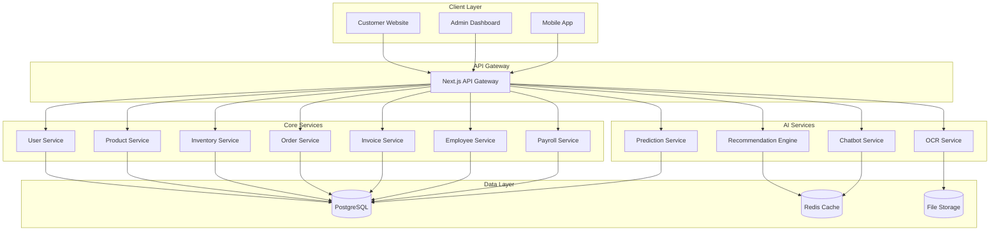
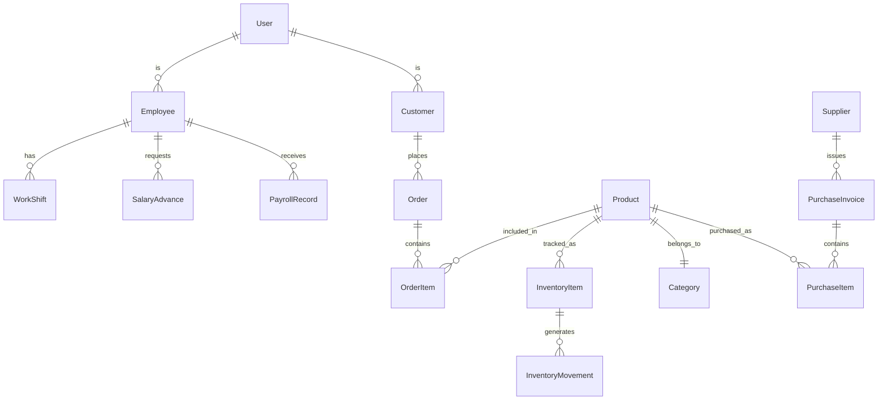

# Design Document

## Overview

The Construction Materials Store Management System is a comprehensive web-based application that manages all aspects of a construction materials retail business. The system consists of three main components:

1. **Admin Dashboard** - Internal management interface for employees and managers
2. **Customer Website** - Public-facing e-commerce platform
3. **AI Services** - Machine learning services for automation and recommendations

The system will be built using a modern web stack with microservices architecture to ensure scalability, maintainability, and performance.

## Architecture

### High-Level Architecture



### Technology Stack

**Frontend:**
- Next.js 14 with App Router for both admin dashboard and customer website
- TypeScript for type safety
- Tailwind CSS for styling
- React Hook Form for form management
- Zustand for state management

**Backend:**
- Next.js API routes as API Gateway
- Node.js microservices for core business logic
- Express.js for service frameworks
- Prisma ORM for database operations

**Database:**
- PostgreSQL for primary data storage
- Redis for caching and session management

**AI/ML:**
- Python-based services using FastAPI
- Tesseract.js for OCR processing
- TensorFlow/PyTorch for recommendation engine
- OpenAI API for chatbot functionality

**Infrastructure:**
- Docker containers for deployment
- File storage for images and documents

## Components and Interfaces

### 1. User Management Component

**Responsibilities:**
- Authentication and authorization
- User profile management
- Role-based access control

**Key Interfaces:**
```typescript
interface User {
  id: string
  email: string
  name: string
  role: 'MANAGER' | 'EMPLOYEE' | 'CUSTOMER'
  phone?: string
  address?: string
  createdAt: Date
  updatedAt: Date
}

interface AuthService {
  login(email: string, password: string): Promise<AuthResult>
  register(userData: CreateUserDto): Promise<User>
  validateToken(token: string): Promise<User>
  refreshToken(refreshToken: string): Promise<AuthResult>
}
```

### 2. Product Management Component

**Responsibilities:**
- Product catalog management
- Category organization
- Price management
- Image handling

**Key Interfaces:**
```typescript
interface Product {
  id: string
  name: string
  description?: string
  category: Category
  price: number
  unit: string
  images: string[]
  isActive: boolean
  createdAt: Date
  updatedAt: Date
}

interface ProductService {
  createProduct(data: CreateProductDto): Promise<Product>
  updateProduct(id: string, data: UpdateProductDto): Promise<Product>
  deleteProduct(id: string): Promise<void>
  getProducts(filters: ProductFilters): Promise<PaginatedResult<Product>>
}
```

### 3. Inventory Management Component

**Responsibilities:**
- Stock level tracking
- Inventory movements
- Low stock alerts
- Audit trail

**Key Interfaces:**
```typescript
interface InventoryItem {
  id: string
  productId: string
  quantity: number
  reservedQuantity: number
  minStockLevel: number
  lastUpdated: Date
}

interface InventoryMovement {
  id: string
  productId: string
  type: 'IN' | 'OUT' | 'ADJUSTMENT'
  quantity: number
  reason: string
  referenceId?: string
  createdAt: Date
}

interface InventoryService {
  updateStock(productId: string, quantity: number, type: MovementType): Promise<void>
  getStockLevel(productId: string): Promise<number>
  getLowStockItems(): Promise<InventoryItem[]>
  recordMovement(movement: CreateMovementDto): Promise<InventoryMovement>
}
```

### 4. Order Management Component

**Responsibilities:**
- Order processing
- Order status tracking
- Customer order history

**Key Interfaces:**
```typescript
interface Order {
  id: string
  customerId: string
  items: OrderItem[]
  totalAmount: number
  status: 'PENDING' | 'CONFIRMED' | 'PROCESSING' | 'SHIPPED' | 'DELIVERED' | 'CANCELLED'
  shippingAddress: Address
  paymentMethod: string
  createdAt: Date
  updatedAt: Date
}

interface OrderItem {
  productId: string
  quantity: number
  unitPrice: number
  totalPrice: number
}

interface OrderService {
  createOrder(data: CreateOrderDto): Promise<Order>
  updateOrderStatus(orderId: string, status: OrderStatus): Promise<Order>
  getOrdersByCustomer(customerId: string): Promise<Order[]>
  getOrderById(orderId: string): Promise<Order>
}
```

### 5. Employee Management Component

**Responsibilities:**
- Employee information management
- Work shift scheduling
- Attendance tracking
- Task assignment

**Key Interfaces:**
```typescript
interface Employee {
  id: string
  userId: string
  employeeCode: string
  department: string
  position: string
  baseSalary: number
  hireDate: Date
  isActive: boolean
}

interface WorkShift {
  id: string
  employeeId: string
  date: Date
  startTime: string
  endTime: string
  type: 'REGULAR' | 'OVERTIME' | 'LOADING'
  status: 'SCHEDULED' | 'COMPLETED' | 'ABSENT'
}

interface EmployeeService {
  createEmployee(data: CreateEmployeeDto): Promise<Employee>
  scheduleShift(data: CreateShiftDto): Promise<WorkShift>
  recordAttendance(employeeId: string, clockIn: Date, clockOut?: Date): Promise<void>
  getEmployeeShifts(employeeId: string, dateRange: DateRange): Promise<WorkShift[]>
}
```

### 6. Payroll Management Component

**Responsibilities:**
- Salary calculations
- Advance management
- Payroll report generation

**Key Interfaces:**
```typescript
interface SalaryAdvance {
  id: string
  employeeId: string
  amount: number
  reason: string
  requestDate: Date
  approvedBy?: string
  status: 'PENDING' | 'APPROVED' | 'REJECTED'
}

interface PayrollRecord {
  id: string
  employeeId: string
  period: string
  baseSalary: number
  bonuses: number
  penalties: number
  totalAdvances: number
  netPay: number
  generatedAt: Date
}

interface PayrollService {
  recordAdvance(data: CreateAdvanceDto): Promise<SalaryAdvance>
  calculatePayroll(employeeId: string, period: string): Promise<PayrollRecord>
  getAdvanceHistory(employeeId: string): Promise<SalaryAdvance[]>
  generatePayrollReport(period: string): Promise<PayrollRecord[]>
}
```

### 7. AI Services Component

**Responsibilities:**
- OCR invoice processing
- Product recommendations
- Chatbot responses
- Inventory predictions

**Key Interfaces:**
```typescript
interface OCRService {
  processInvoice(imageBuffer: Buffer): Promise<OCRResult>
  extractProductData(ocrText: string): Promise<ProductData[]>
}

interface RecommendationService {
  getProductRecommendations(customerId: string, limit: number): Promise<Product[]>
  getRelatedProducts(productId: string, limit: number): Promise<Product[]>
  updateUserPreferences(customerId: string, interactions: UserInteraction[]): Promise<void>
}

interface ChatbotService {
  processMessage(message: string, context: ChatContext): Promise<ChatResponse>
  getProductInfo(productQuery: string): Promise<ProductInfo>
}

interface PredictionService {
  predictInventoryNeeds(timeframe: number): Promise<InventoryPrediction[]>
  analyzeSalesTrends(productId: string): Promise<SalesTrend>
}
```

## Data Models

### Core Entity Relationships



### Database Schema Design

**Users Table:**
- Primary authentication and basic user information
- Supports multiple user types (managers, employees, customers)

**Products Table:**
- Complete product catalog with pricing and categorization
- Supports multiple images per product

**Inventory Table:**
- Real-time stock tracking with reserved quantities
- Automated low-stock alerts

**Orders Table:**
- Complete order lifecycle management
- Integration with inventory for automatic stock updates

**Employees Table:**
- Extended user information for internal staff
- Links to payroll and scheduling systems

## Error Handling

### Error Categories

1. **Validation Errors** - Invalid input data
2. **Business Logic Errors** - Rule violations (e.g., insufficient stock)
3. **System Errors** - Database connectivity, external service failures
4. **Authentication Errors** - Invalid credentials, expired tokens

### Error Response Format

```typescript
interface ErrorResponse {
  success: false
  error: {
    code: string
    message: string
    details?: any
    timestamp: string
  }
}
```

### Error Handling Strategy

- **Client-side**: Form validation with real-time feedback
- **API Gateway**: Request validation and sanitization
- **Service Layer**: Business rule validation and error logging
- **Database Layer**: Transaction rollback on failures

## Testing Strategy

### Unit Testing
- Jest for JavaScript/TypeScript components
- Pytest for Python AI services
- Mock external dependencies
- Aim for 80%+ code coverage

### Integration Testing
- API endpoint testing with Supertest
- Database integration tests with test containers
- AI service integration tests

### End-to-End Testing
- Playwright for critical user journeys
- Automated testing of key workflows:
  - Customer order placement
  - Inventory management
  - Employee payroll processing
  - OCR invoice processing

### Performance Testing
- Load testing for API endpoints
- Database query optimization
- Caching strategy validation
- AI service response time monitoring

### Security Testing
- Authentication and authorization testing
- Input validation and sanitization
- SQL injection prevention
- XSS protection validation